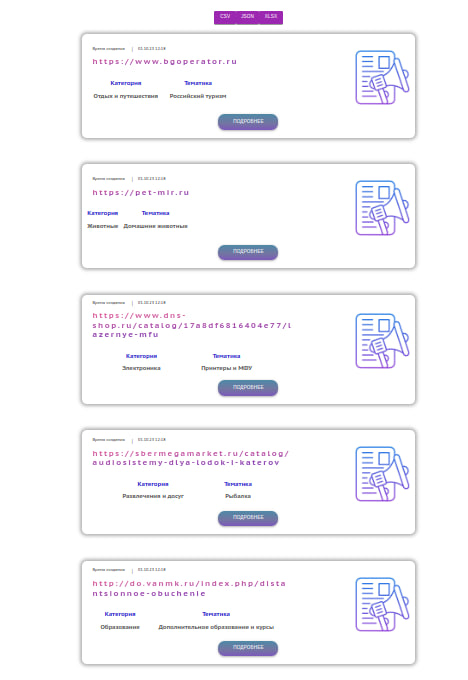

 

    
  <h1 align="center">Кокос Hackathon 2023</h1>
  <h2 align="center">
    MISIS Banach Space
  </h2>

# ![Сервис]

# Сервис по определению тематики сайта
<table>
<tr>
<td>
  Мы создали сервис, который собирает данные о странице и на их основе определяет тематику сайта из ранее заданных. При решении задачи использовались два подхода к категоризации данных: поступившие данные проходят лемматизацию и сравниваются с ключевыми словами и обученная нами модель машинного обучения. 
</td>
</tr>
</table>

## Функционал

### Главная страница
На главной странице есть возможность есть возможность по кнопке "Анализ Сайтов" присылать ссылки на обработку. Реализована возможность присылать .csv файл( в нем должна быть одна колонка с корректными сслыками) для удобства отправки данных. Отправка данных происходит разделения данных на категории: домены и подстраницы

### Мои Запросы
На этой странице мы получаем все наши записи, которые в зависимости от времени обработки показывают Категории и Тематики. Все эти данные можно получить в трех форматах: .csv, .json, .xlsx. При нажатии на кнопку "Подробнее" мы переходим на анализ сайта по данной ссылке

### Анализ Сайта
Здесь можно увидеть Категорию и Тематику сайта, а также по возможности( если такие мета данные существуют и у нас есть на них доступ) мы получаем описание сайта.

Для некоторых сайтов 

### Технологии

* <a href='https://ru.vuejs.org'>Vue
* <a href='https://react.dev'>React
* <a href='https://mui.com'>Mui-Materials
* <a href='https://www.typescriptlang.org'>TypeScript

