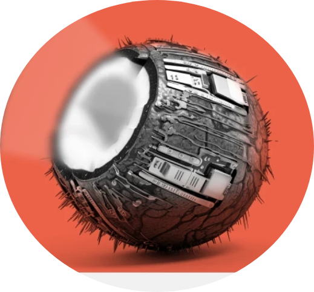

 

    
  <h1 align="center">Кокос Hackathon 2023</h1>
  <h2 align="center">
    MISIS Banach Space
  </h2>

# Сервис по определению тематики сайта
<table>
<tr>
<td>
  Мы создали сервис, который собирает данные о странице и на их основе определяет тематику сайта из ранее заданных. При решении задачи использовались два подхода к категоризации данных: сравнение с ключевыми словами и модель машинного обучения. 
</td>
</tr>
</table>

## Функционал

### Технологии

This section should list any major frameworks/libraries used to bootstrap your project. Leave any add-ons/plugins for the acknowledgements section. Here are a few examples.

* [![Next][Next.js]][Next-url]
* [![React][React.js]][React-url]
* [![Vue][Vue.js]][Vue-url]
* [![Angular][Angular.io]][Angular-url]
* [![Svelte][Svelte.dev]][Svelte-url]
* [![Laravel][Laravel.com]][Laravel-url]
* [![Bootstrap][Bootstrap.com]][Bootstrap-url]
* [![JQuery][JQuery.com]][JQuery-url]
